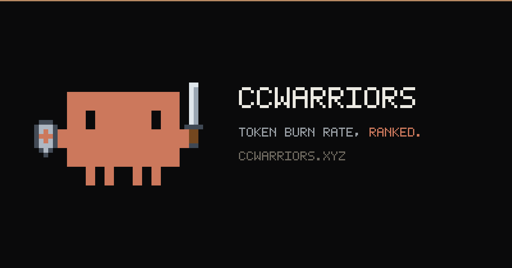

<p align="center">
  
</p>

# ccwarriors

**Token burn rate, ranked.** A live leaderboard of AI coding spend — [Claude Code](https://claude.ai/code),
Codex, Gemini CLI, Copilot, OpenCode, Amp and every other agent [ccusage](https://github.com/ryoppippi/ccusage)
can read. See who's burning the most tokens, claim your rank, flex on the timeline.

**Live:** [ccwarriors.xyz](https://ccwarriors.xyz)

## Enlist (one command)

```bash
curl -fsSL https://api.ccwarriors.xyz/install.sh | bash
```

That's it. GitHub login opens in your browser, your [ccusage](https://github.com/ryoppippi/ccusage)
totals are read locally, and you're on the board. Re-sync anytime with `ccwarriors`.

Only two numbers ever leave your machine: your 30-day and all-time cost totals.
No code, no prompts, no project data.

## How it works

```
ccwarriors (CLI)                     api.ccwarriors.xyz                ccwarriors.xyz
────────────────                     ──────────────────               ───────────────
ccusage totals ──► POST /ingest ──►  Hono + Postgres                  React + WebSocket
GitHub loopback OAuth                tiers, ranks, rate limits   ──►  live board, rows slide
                                     WebSocket broadcast               as ranks change
```

- **CLI** (`packages/cli`) — zero-dependency single-file Node bundle. GitHub
  loopback OAuth, reads costs via `ccusage`, posts to the API. Distributed by the
  site itself (`/install.sh` + `/cli.js`) — every deploy is a CLI release.
- **API** (`apps/server`) — Hono + `ws` on Railway, Postgres via Drizzle.
  Token-authenticated ingest (rate-limited, sanity-capped, transactional),
  Minecraft-style tiers (Stone → Netherite), debounced WebSocket broadcasts.
- **Web** (`apps/web`) — Vite + React on Vercel. Light/dark, Framer Motion
  leaderboard that re-sorts live, collectible warrior cards (15 muted
  anime-nature scenes), pixel Clawd branding.

## Sponsors

CCWarriors is free and open source — sponsorships keep the servers burning.

- **[GitHub Sponsors](https://github.com/sponsors/distroinfinity)** — one-time or monthly
- **UPI / card (India)** — [ccwarriors.xyz/#sponsor](https://ccwarriors.xyz/#sponsor) (Razorpay)
- **Crypto** — EVM address on [ccwarriors.xyz/#sponsor](https://ccwarriors.xyz/#sponsor)

Tiers run Wood 🪵 → Netherite 🔥, just like the board.

<p align="center">
  <a href="https://ccwarriors.xyz/#sponsor">
    
  </a>
</p>

## Local development

```bash
pnpm install

# backend — in-memory Postgres (PGlite) + 15 seeded demo warriors + simulated
# live spend, on :8787 (demo data is local-only, never in production)
pnpm --filter server dev

# frontend — :5173
pnpm --filter web dev
```

Node ≥ 20 and pnpm required. See [`DEPLOY.md`](DEPLOY.md) for production setup
(Railway, Vercel, DNS, GitHub OAuth app) and `apps/server/.env.example` for
configuration.

## Repo layout

```
apps/server     Hono API + WebSocket + Drizzle/Postgres
apps/web        Vite + React leaderboard (serves the CLI installer)
packages/cli    the ccwarriors CLI
scripts/        zero-dep PNG generators (logo, OG banner, favicon)
docs/           design spec + implementation plans
```

---

Built with ❤️ by [Manu](https://x.com/distroinfinity)
